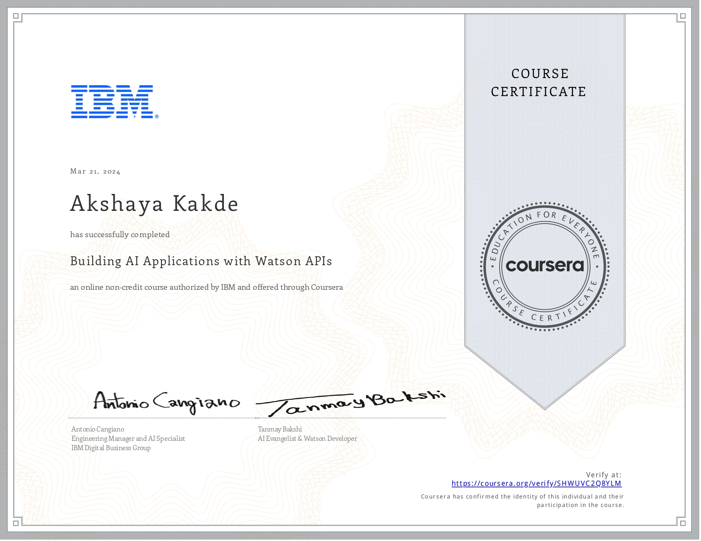
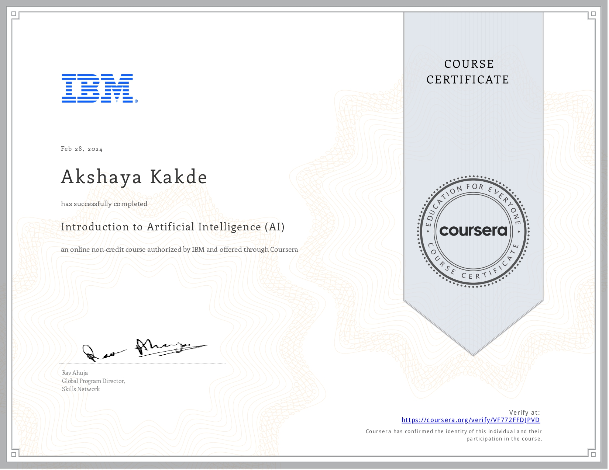
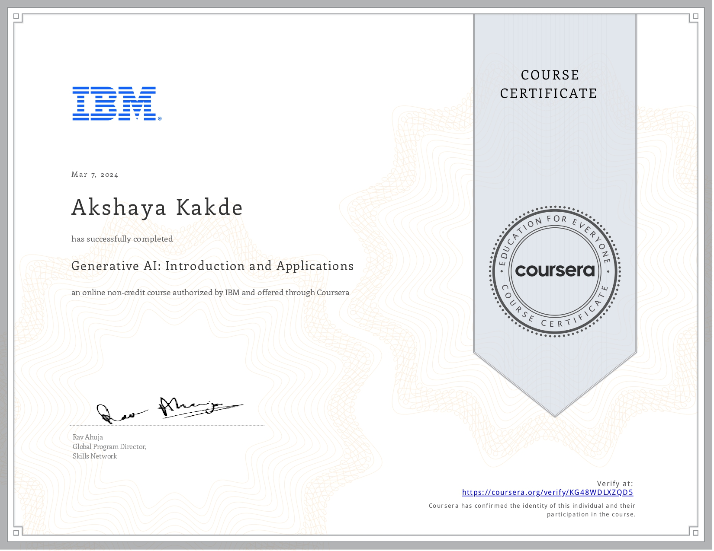
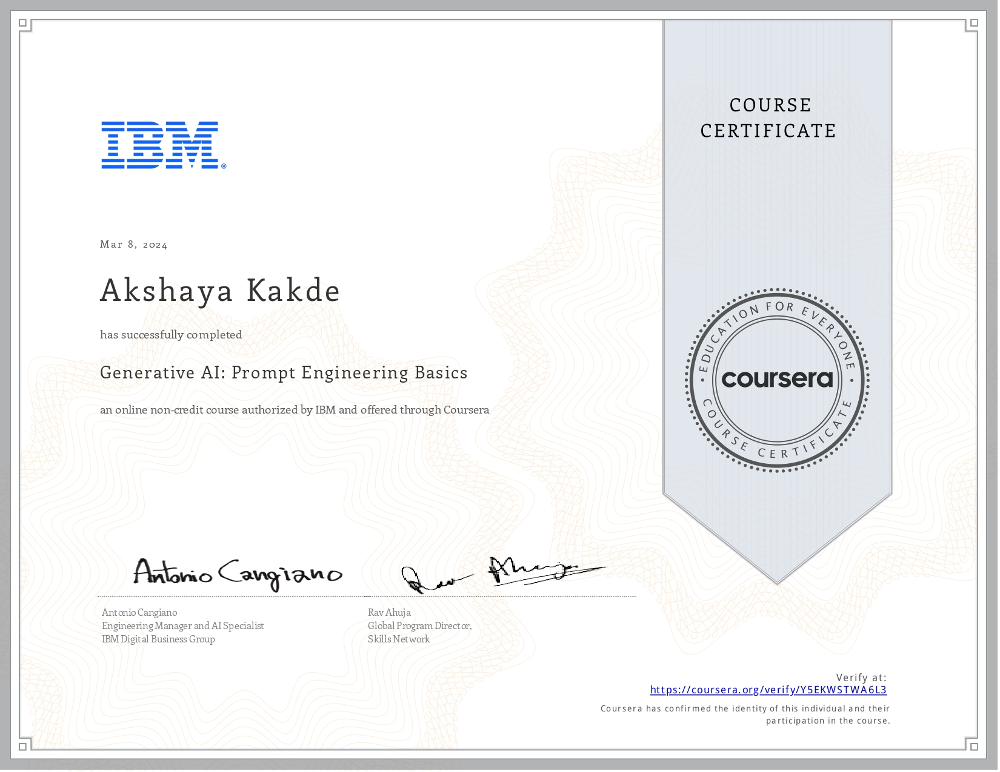
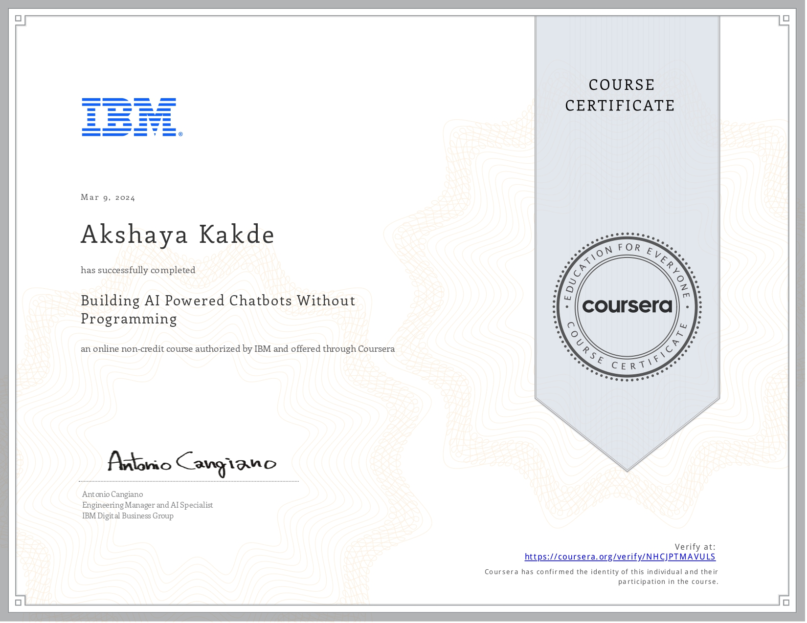
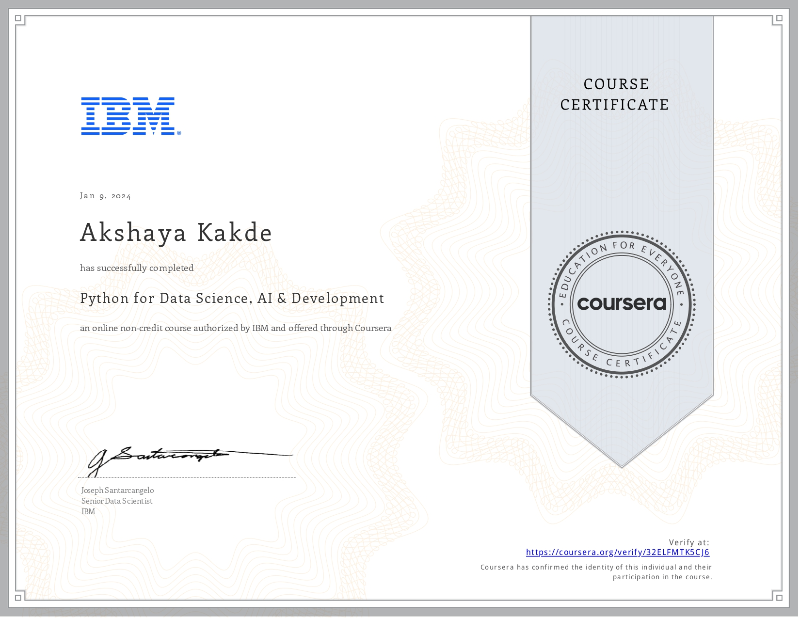
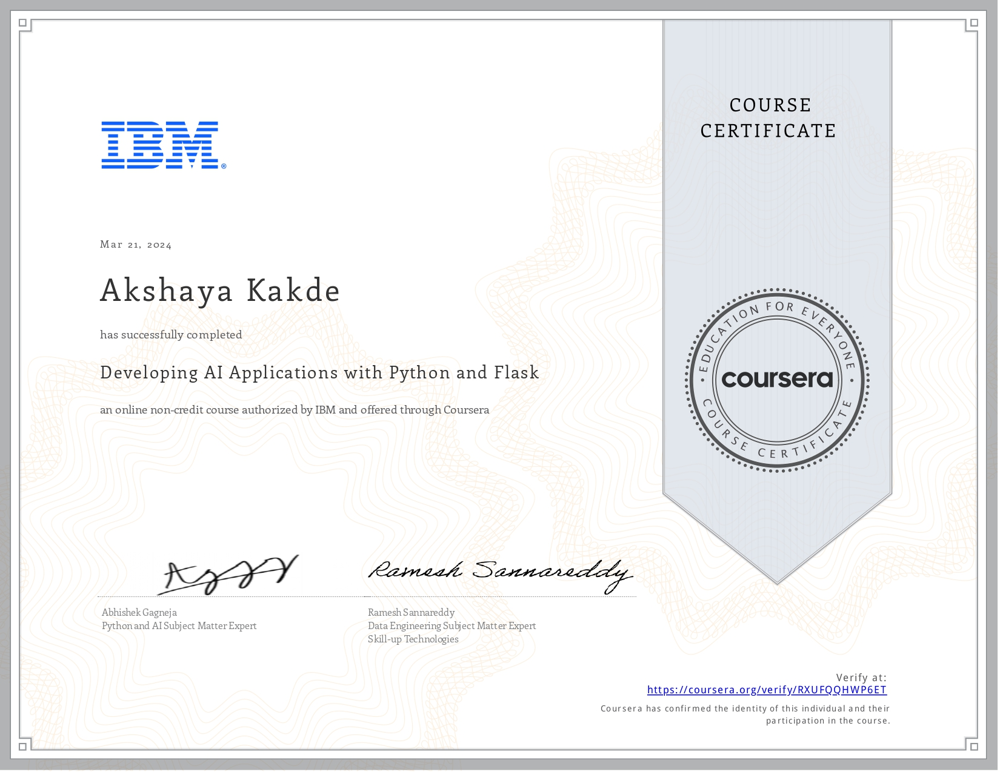

# 🤖 IBM-Applied-AI-Professional-Certificate 🎓
by **IBM**

**Author : Akshaya Kakde**

Welcome to my GitHub repository showcasing the culmination of my journey through various IBM courses on Artificial Intelligence (AI) and Python development. This repository serves as a comprehensive documentation of the skills and knowledge acquired across a range of topics, including AI fundamentals, generative AI, chatbot development, Python for data science, and AI application with Watson APIs.

Throughout these courses, I've delved into the intricacies of AI technologies, exploring their applications across diverse domains such as healthcare, finance, education, and more. From understanding the foundational principles of AI to mastering advanced techniques like prompt engineering and generative AI, each course has provided invaluable insights and hands-on experience.

**🌟 Key highlights of this repository include :**

*- Introduction to Artificial Intelligence (AI) :* Explores the fundamental impact of AI across various sectors, from healthcare and education to law enforcement and customer service.

*- Generative AI: Introduction and Applications :* Provides a deep dive into the capabilities and applications of Generative AI, covering basic concepts, industry applications, and hands-on experience with cutting-edge tools.

*- Generative AI : Prompt Engineering Basics :* Delves into the crucial aspect of prompt engineering in generative AI, offering insights into crafting effective prompts to optimize model performance.

*- Building AI Powered Chatbots Without Programming :* Equips learners with the skills to create AI-powered chatbots without any programming background, covering topics such as natural language processing (NLP), chatbot building platforms, and real-world deployment.

*- Python for Data Science, AI & Development :* Covers essential Python skills necessary for data science, artificial intelligence, and software development, including data manipulation, machine learning, and web development.

*- Developing AI Applications with Python and Flask :* Provides a comprehensive introduction to Python programming language and its applications in data science, AI, and web development, with hands-on experience in various Python libraries.

*- Building AI Applications with Watson APIs :* Focuses on leveraging Watson APIs to develop AI applications, covering topics such as natural language understanding, language translation, visual recognition, and conversational interfaces.

Each course is accompanied by practical projects and hands-on experience, demonstrating the application of learned concepts in real-world scenarios.
Explore the repository to delve into the world of AI and Python development.

## 📚 Course 1 : Introduction to Artificial Intelligence (AI)

**About This Course :**

I recently completed the IBM course "Introduction to Artificial Intelligence (AI)," which provided comprehensive insights into how AI is being integrated across various sectors. The course outlined the fundamental impact of AI-powered applications in fields ranging from healthcare and education to law enforcement and customer service.

**What I Learned :**

Throughout this course, I gained knowledge on the expansive role of AI in :

- Healthcare : Enhancing patient diagnosis and clinical trials.
- Education : Personalizing learning experiences.
- Customer Service : Improving response times and accuracy.
- Finance : Preventing fraud and optimizing trading strategies.
- Law Enforcement : Analyzing data to solve crimes more efficiently.
Key Applications Explored
- Robotics and Automation : Implementing AI for robots to operate in unpredictable environments.
- Airport Security : Utilizing AI in X-ray scanners to detect suspicious items.
- Oil and Gas Industry : Applying AI in geological analysis to determine optimal drilling sites.

## 🎨 Course 2 : Generative AI: Introduction and Applications

**Overview :**

This repository documents my journey through IBM's "Generative AI : Introduction and Applications" course. The course provided a deep dive into the capabilities and applications of Generative AI, covering everything from basic concepts to advanced implementations across various domains.

**What I Learned :-**

**Week 1 : Fundamentals of Generative AI** 

- Introduction to Generative AI : Understanding the evolution and fundamental concepts of Generative AI.
- Technology Behind Creativity : Exploration of key models like GANs, VAEs, and transformers.
- Hands-On Experience : Applied learning in generating new content through practical use cases.

**Week 2 : Applications Across Domains**

- Industry Applications : Insight into Generative AI applications in IT, DevOps, entertainment, finance, medicine, and human resources.
- Tool Proficiency : Experimentation with text and image generation tools including OpenAI's ChatGPT, Google Bard, DALL-E, and Adobe Firefly.
- Enhanced Workflow : How Generative AI is making workplace tasks more efficient.

**Week 3 : Mastering Generative AI Tools**

- Advanced Generative Techniques : Deep dive into creating text, images, audio, video, and code.
- Tool Exploration : Hands-on with tools like GitHub Copilot and IBM Watson Code Assistant for code generation.
Key Projects.
- Here are a few projects I've worked on as part of this course, demonstrating the application of Generative AI in practical scenarios :

- Text Generation with ChatGPT : Developed a chatbot that simulates conversation flows and provides customer service solutions.
- Image Creation with DALL-E : Experimented with generating unique artwork from textual descriptions.
- Code Generation : Enhanced existing codebases using GitHub Copilot, improving efficiency and functionality.

## 💡 Course 3 : Generative AI: Prompt Engineering Basics

**Course Overview :**

Welcome to my repository documenting the IBM course "Generative AI : Prompt Engineering." This course delved into the crucial aspect of prompt engineering in generative AI, providing insights into crafting effective prompts to optimize the performance of AI models.

**Key Lessons Learned**

**Week 1 : Understanding Prompts and Prompt Engineering** 

- Definition of Prompts : Introduction to prompts as instructions given to generative models.
- Elements of a Well-Structured Prompt : Instruction, context, input data, and output indicators.
- Importance of Prompt Engineering : Designing effective prompts to guide model creativity.
- Best Practices : Writing clear, contextual, precise, and role-play prompts.
Tools and Platforms : Exploration of prompt engineering tools like IBM Watsonx Prompt Lab and Spellbook.

**Week 2 : Techniques for Effective Prompting**

- Zero-Shot and Few-Shot Prompting : Techniques to improve reliability and quality of model output.
- Task Specification and Contextual Guidance : Leveraging prompts to steer model responses.
- Interview Pattern, Chain-of-Thought, and Tree-of-Thought : Innovative approaches for dynamic and structured conversations with AI models.

**Week 3 : Applying Prompt Engineering Approaches**

- Enhancing Model Performance : Utilizing prompt engineering to produce precise and relevant responses.
- Text-Prompt Techniques : Exploring zero-shot and few-shot prompting for improved model reliability.
- Common Prompt-Engineering Tools : Hands-on experience with tools like IBM Watsonx Prompt Lab and Dust.

**Projects and Hands-On Experience :**

During this course, I had the opportunity to engage in practical lab experiences, experimenting with prompt engineering techniques and tools. 
Here are some highlights :

- Creating Effective Prompts : Hands-on practice in crafting prompts for various AI models.
- Exploring Prompt Engineering Tools : Experimentation with IBM Watsonx Prompt Lab and Spellbook for prompt optimization.

## 🤖 Course 4 : Building AI Powered Chatbots Without Programming

**Certification Overview :**

Welcome to my GitHub repository showcasing the IBM certification "Building AI Powered Chatbots Without Programming." This certification equips learners with the skills and knowledge necessary to create AI-powered chatbots without any programming background.

**Course Content :**
The certification covers a range of topics, including :

- Introduction to chatbots and conversational AI.
- Understanding natural language processing (NLP) and natural language understanding (NLU).
- Utilizing chatbot building platforms and tools.
- Designing conversational flows and intents.
- Integrating AI and machine learning into chatbots.
- Testing and deploying chatbots for real-world use cases.

**Key Skills Acquired :**
Throughout the certification, I gained proficiency in :

- Understanding the principles of chatbot development and conversational AI.
- Leveraging chatbot building platforms to create chatbots without programming.
- Designing conversational flows and intents to simulate human-like interactions.
- Integrating AI and machine learning capabilities into chatbots for enhanced functionality.
- Testing and deploying chatbots to address real-world business challenges.

**Projects and Hands-On Experience :**

During the certification, I completed several projects to apply my learning and gain practical experience in building AI-powered chatbots. Some of the projects include :

- Creating a customer support chatbot to assist users with common inquiries.
- Developing a virtual assistant chatbot for scheduling appointments and reminders.
- Building a FAQ chatbot to provide answers to frequently asked questions.

## 🐍 Course 5 : Python for Data Science, AI & Development

**Course Overview :**

Welcome to my GitHub repository showcasing the IBM certification "Python for Data Science, AI & Development." This certification is designed to equip learners with the fundamental Python skills necessary for data science, artificial intelligence, and software development.

**Course Content :**
The certification covers a comprehensive range of topics, including :

- Introduction to Python programming language.
- Python basics, data structures, and control flow
Working with data using libraries like NumPy and Pandas.
- Introduction to machine learning with Python.
- Building AI applications with Python libraries like TensorFlow and Scikit-learn.
- Web development and automation using Python.

**Key Skills Acquired :**

Throughout the certification, I acquired essential skills in :

- Python programming fundamentals.
- Data manipulation and analysis using NumPy and Pandas.
- Building machine learning models for predictive analytics.
- Developing AI applications using TensorFlow and Scikit-learn.
- Web development and automation with Python.

**Projects and Hands-On Experience :**

During the certification, I completed several projects to reinforce my learning and gain practical experience. Some of the projects include :

- Analyzing and visualizing real-world datasets using NumPy and Pandas
Building and training machine learning models for classification and regression tasks.
- Developing AI applications for image classification and natural language processing.
- Creating web applications and automating repetitive tasks using Python frameworks.

## 🌐 Course 6 : Developing AI Applications with Python and Flask

**Course Overview :**

Welcome to my GitHub repository documenting the IBM course "Python for Data Science, AI & Development." This course provided a comprehensive introduction to Python programming language and its applications in data science, artificial intelligence, and software development.

## Key Takeaways

**Introduction to Python :**

- Python's Popularity : Python is the most widely used programming language in the data science industry, with over 75% of data science positions requiring Python skills.
- Benefits of Python : Python boasts clear and readable syntax, making it ideal for both beginners and experienced programmers.
- Applications of Python : Python is versatile, used in various fields such as data science, AI, machine learning, web development, and IoT devices.
- Python Libraries : For data science, Python offers powerful libraries like Pandas, NumPy, SciPy, and Matplotlib, as well as tools for AI like TensorFlow, PyTorch, and NLTK for NLP.
- Diversity and Inclusion in Python Community
Inclusive Community : The Python community emphasizes diversity and inclusion, with efforts led by organizations like PyLadies to create safe and inclusive spaces for all individuals interested in Python programming.
- Code of Conduct : The Python Software Foundation enforces a code of conduct to ensure safety and inclusivity in both online and in-person Python communities.

**Projects and Hands-On Experience :**

Throughout this course, I gained practical experience in Python programming and explored various Python libraries for data analysis, AI, and development. Here are some highlights :

- Data Analysis with Pandas : Analyzed datasets using Pandas to gain insights and make data-driven decisions.
- Machine Learning with Scikit-learn : Built and trained machine learning models using Scikit-learn to solve classification and regression tasks.
- Web Scraping with BeautifulSoup : Extracted data from websites using BeautifulSoup library for web scraping.

## 🧠 Course 7 : Building AI Applications with Watson APIs

**Certification Overview :**

Welcome to my GitHub repository showcasing the IBM certification "Building AI Applications with Watson APIs." This certification equips learners with the skills and knowledge necessary to leverage the power of Watson APIs in developing AI applications.

**Course Content :**
The certification covers a range of topics, including :

- Introduction to Watson APIs
- Utilizing Watson Natural Language Understanding (NLU)
- Implementing Watson Language Translator
- Integrating Watson Visual Recognition
- Applying Watson Speech to Text and Text to Speech
- Building AI-powered applications with Watson Assistant

**Key Skills Acquired :**
Throughout the certification, I gained proficiency in :

- Understanding the capabilities and applications of various Watson APIs.
- Implementing natural language processing and understanding using Watson NLU.
- Translating text between different languages with Watson Language Translator.
- Incorporating visual recognition capabilities into applications using Watson Visual Recognition.
- Integrating speech to text and text to speech functionalities with Watson APIs.
- Developing AI-driven conversational interfaces with Watson Assistant.

**Projects and Hands-On Experience :**

During the certification, I completed several projects demonstrating the practical application of Watson APIs in real-world scenarios. Some of the projects include :

- Building a sentiment analysis tool using Watson NLU to analyze customer feedback.
- Developing a multilingual chatbot using Watson Language Translator for global communication.
- Creating an image recognition system using Watson Visual Recognition for object detection.

Specialisation completed on **21 March 2024** 🎉

**Link for verification :**

https://coursera.org/verify/SHWUVC2Q8YLM

